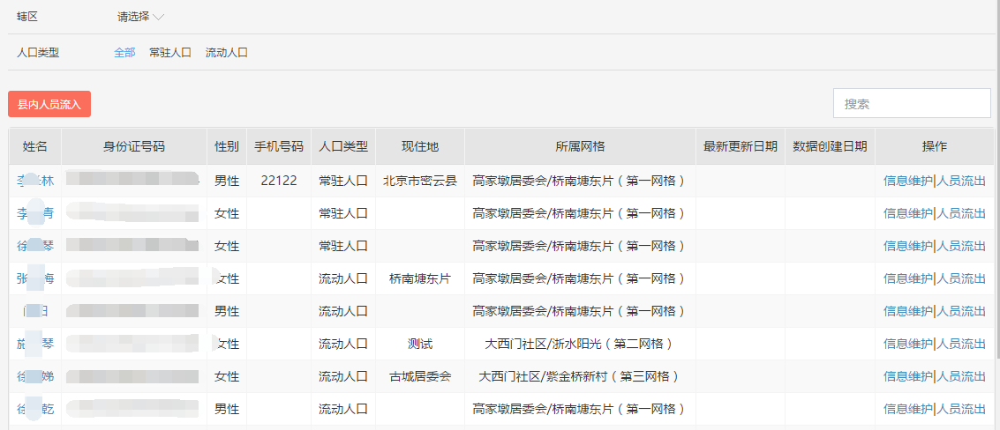
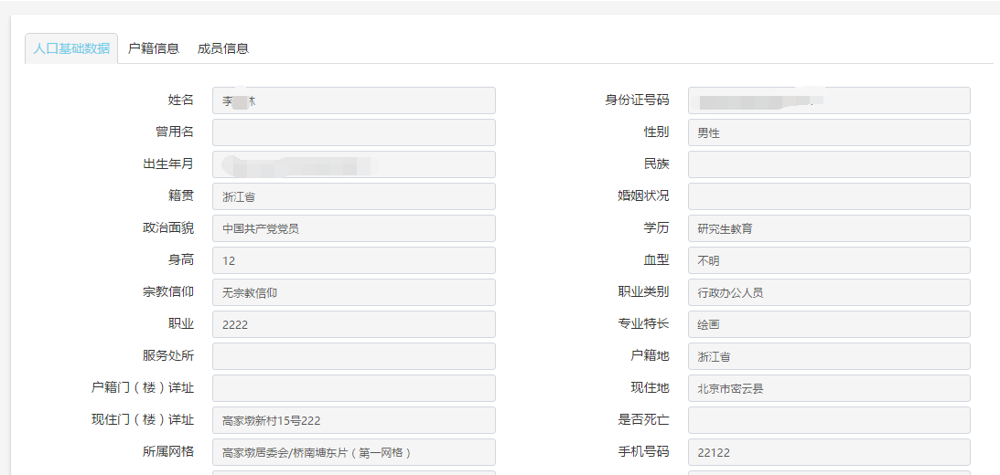
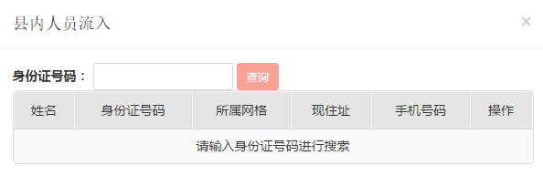
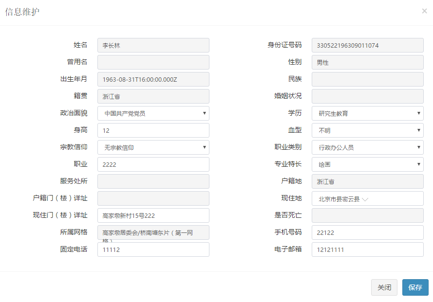

## Vue组件列表

* 常规列表
    + 引用名称：vueBsTable
    + 源码路径："/cig/vue/vue-bs-table/main"
    + html标签：bs-table
    + 主要属性：loading rows columns
    + 使用说明：用于显示普通的几行数据
* 常规树组件
    + 引用名称：vueBsTreeview
    + 源码路径："/cig/vue/vue-bs-treeview/main"
    + html标签：bs-treeview
    + 主要属性：data valuePath node-component
    + 使用说明：用于显示树形结构内容，支持v-model
* 常规弹出窗口
    + 引用名称：vueBsPop
    + 源码路径:"/cig/vue/vue-bs-pop/main"
    + html标签：bs-pop
    + 主要方法：show(),hide()
    + 使用说明：支持弹出窗口
* 常规标签页
    + 引用名称：vueBsTab
    + 源码路径:"/cig/vue/vue-bs-tab"
    + html标签：bs-tab
    + 主要属性：tabs({name:"",text:""}) select
    + 使用说明：按照tabs的顺序展示标签，标签内显示slot为name的内容

* 通用查询
    + 引用名称：vueTableFilter
    + 源码路径："/cig/vue/vue-table-filter/main"
    + html标签：cig-table-filter
    + 主要属性： filters filter
    + 使用说明：按照filter的设置项，显示通用查询内容，有变化后会反馈到filter上 支持v-model

* jq版的通用查询：
    + 引用名称：vueJqTableFilter
    + 源码路径："/cig/vue/vue-table-filter/jq",
    + html标签： 无
    + 主要属性：同vueTableFilter ，多一个change
    + 使用说明：$().tableFilter({filters:[],change:function(){}})

* 异步查询表格：
    + 引用名称：vueTable
    + 源码路径："/cig/vue/vue-table"
    + html标签：cig-table
    + 主要属性：table-ajax-options columns
    + 使用说明：当ajax-options变化时，会自动附加offset 和 limit参数去服务器拿数据，根据total 和 rows 显示数据
    + 模块提供的方法：table.helper.getDomainDisplayComponent(field,domainName) 返回自动按照domainName的配置，根据value转换为text的组件 

* 选择辖区控件：
    + 引用名称：vueArea
    + 源码路径："/cig/vue/vue-area/main"
    + 包含两个控件：
    + html标签：cig-area
    + 主要属性：data node-component value-path loading
    + 使用说明：指定data，生成选择控件，支持v-model
    + html标签：cig-ajax-area
    + 主要属性：ajax-options node-component value-path loading
    + 使用说明：按照指定的ajax-options去加载数据，默认加载pid为空的数据，选择后，去加载pid为选中项id的数据

* 表单控件
    + 引用名称：vueForm
    + 源码路径："/cig/vue/vue-form/main",
    + html标签：cig-form
    + 主要属性：data-path fields
    + 使用说明：按照指定的fields，将表格布局，并生成自动绑定的控件。当在form内部存在slot="fieldslot.fieldname"的控件时，会将该内容自动渲染到fieldname的位置
    + 模块提供的方法：form.helper.getFieldsMixin(fields,def) 返回 data:{fields:fields,data:{/*根据fields生成的默认值*/}}
    + 模块提供的方法：form.helper.getValidatorMixin(validatorOptions,formRef, dataPath) 返回 watch:{"data.field1":function(){/*按规则校验，如果出现错误，自动调用form的setValidation方法*/}}

## 前端常规页面推荐规范

#### 通用过滤条件+按钮+查询+表格

```
    <div id="mainTable">
        <cig-table-filter :filters="filters" :domain-ajax-options="domainAjaxOptions" v-model="filter" @input="doSearch()"></cig-table-filter>
        <div class="bootstrap-table">
            <div class="fixed-table-toolbar">
                <div class="bs-bars pull-left cig-bars">
                    <template v-for="btn in btns">
                        <button v-if="btn.visible !== false"
                            :class="['btn btn-sm',btn.baseClass, btn.disabled ? 'disabled' : btn.enableClass]" 
                            :disabled="btn.disabled" 
                            @click="executeCommand(btn.id)">{{btn.name}}</button>
                    </template>
                </div>
                <div class="columns columns-right btn-group pull-right">
                </div>
                <div class="pull-right search">
                    <input class="form-control" v-model="keyword" @keyup.enter="doSearch()" type="text" placeholder="搜索">
                </div>
            </div>
            <cig-table 
                :config="tableConfig"
                :columns="tableColumns"
                :ajax-options="tableAjaxOptions">
            </cig-table>
        </div>
    </div>
```



示例路径：/views/zhzl/syrk/hjrk.tpl

#### 表单或详情界面

```
<div class="content">
    <div id="detail" class="bg-white detail-stage">
        <!-- /.modal-content -->
        <div is="bs-tab" :tabs="tabs.rkTabs" @select="rkTabSelect">
            <div slot="main">
                <!--基本信息-->
                <div class="form-horizontal form-group-sm">
                    <cig-form :fields="fields.main" data-path="main"></cig-form>
                </div>
            </div>
            <div slot="ldgj">
                <!--家庭成员（亲属关系）-->
                <div class="bootstrap-table">
                    <bs-table 
                        :loading="ldgj.load === false"
                        :config="tableConfig.ldgj"
                        :columns="columns.ldgj"
                        :rows="ldgj">
                    </cig-table>
                </div>
            </div>
            <div slot="hj">
                <!--户籍信息-->
                <div class="form-horizontal form-group-sm">
                    <cig-form :fields="fields.hj" data-path="hj"></cig-form>
                </div>
                <div class="bootstrap-table">
                    <bs-table 
                        :loading="hj.load === false"
                        :config="tableConfig.hjMember"
                        :columns="columns.hjMember"
                        :rows="hj.members">
                    </cig-table>
                </div>
            </div>
            <div slot="lr">
                <!--流入信息-->
                <div class="form-horizontal form-group-sm">
                    <cig-form :fields="fields.lr" data-path="lr"></cig-form>
                </div>
            </div>
            <div slot="jzfw" v-if="jzfw">
                <!--居住房屋-->
                <div class="form-horizontal form-group-sm">
                    <cig-form :fields="fields.jzfw" data-path="jzfw">
                        <span class="form-control" slot="fieldslot.pName">
                            <a :href="'rkDetail.html?id='+jzfw.pId+'&module='+moduleName">{{jzfw.pName}}</a>
                        </span>
                        <span class="form-control" slot="fieldslot.czName">
                            <a v-if="jzfw.czId" :href="'rkDetail.html?id='+jzfw.czId+'&module='+moduleName">{{jzfw.czName}}</a>
                            <template v-else>{{jzfw.czName}}</template>
                        </span>
                    </cig-form>
                </div>
            </div>
            <div slot="cy">
                <!--家庭成员（亲属关系）-->
                <div class="bootstrap-table">
                    <bs-table 
                        :loading="cy.load === false"
                        :config="tableConfig.cy"
                        :columns="columns.cy"
                        :rows="cy">
                    </cig-table>
                </div>
            </div>
        </div>
    </div>
</div>
```



示例路径：/views/zhzl/syrk/rkDetail.tpl

#### 弹窗+简单表格界面

```
<div id="add" is="bs-pop" 
    type="" title="县内人员流入" ref="pop">
    <div ref="alert"></div>
    <!-- /.modal-content -->
    <div class="bootstrap-table">
        <div class="fixed-table-toolbar">
            <div class="row form-group-sm form-inline">
                <div class="col-md-12">
                    <label class="label-control">公民身份证号码：</label>
                    <input class="form-control" v-model.trim="keyword" @keyup.enter="doSearch()" type="text" >
                    <button class="btn btn-sm btn-danger" :disabled="!keyword" @click="doSearch()">查询</button>
                </div>
            </div>
        </div>
        <bs-table 
            :config="tableConfig"
            :columns="tableColumns"
            :loading-message="loadingMessage"
            :loading="!searched"
            :rows="rows">
        </bs-table>
    </div>
</div>
```



示例路径：/views/zhzl/syrk/hjrk.tpl

#### 弹窗+表单界面

```
<div id="edit" is="bs-pop" 
    type="lg" title="信息维护" ref="pop">
    <div ref="alert"></div>
    <!-- /.modal-content -->
    <div class="form-horizontal form-group-sm">
        <cig-form :fields="fields" data-path="data" ref="form">
            <div slot="fieldslot.residence" class="form-control">
                <cig-area
                    :loading="false" 
                    :data="hjd" 
                    value-path="id" 
                    name-path="text" 
                    nodes-path="nodes" 
                    v-model="data.residence" 
                    node-component="<span>{{item.text}}</span>" 
                ></cig-area>
            </div>
        </cig-form>
    </div>
    <template slot="footer">
        <button type="button" class="btn btn-default" @click="close">关闭</button>
        <button type="button" class="btn btn-primary" @click="save">保存</button>
    </template>
</div>
```



示例路径：/views/zhzl/syrk/hjrk.tpl

